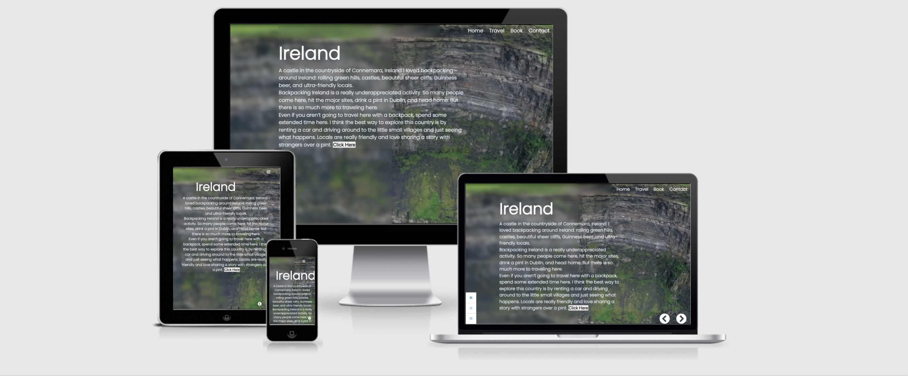
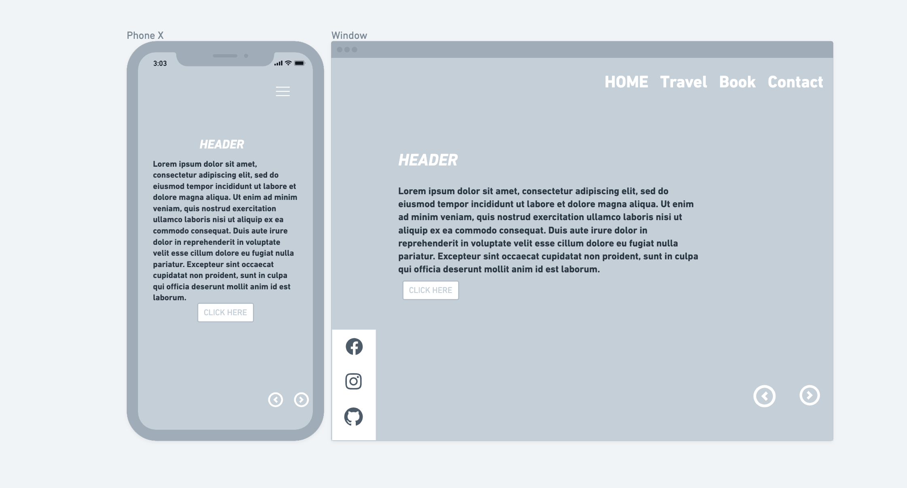
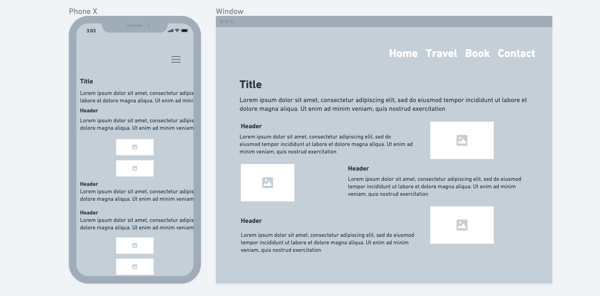
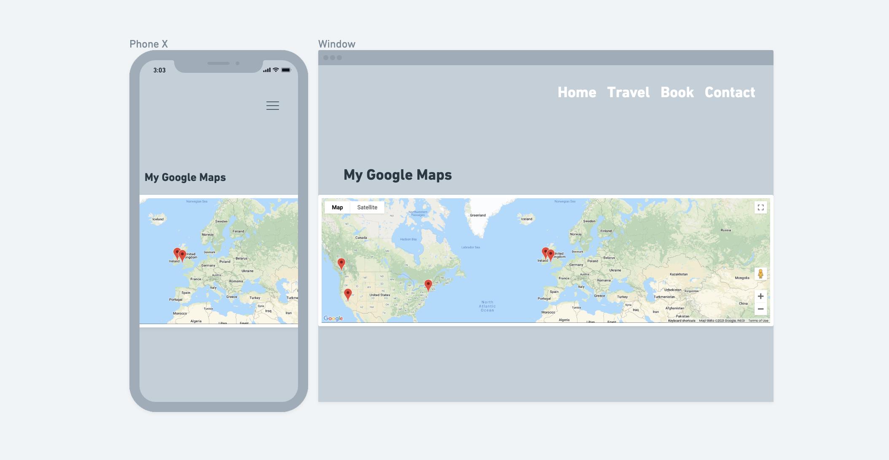
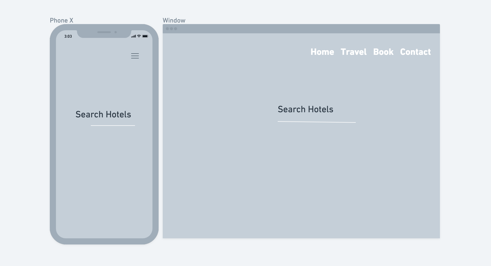
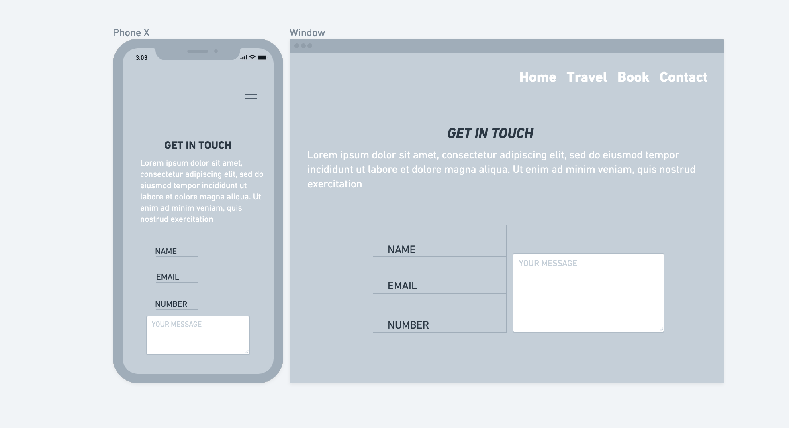
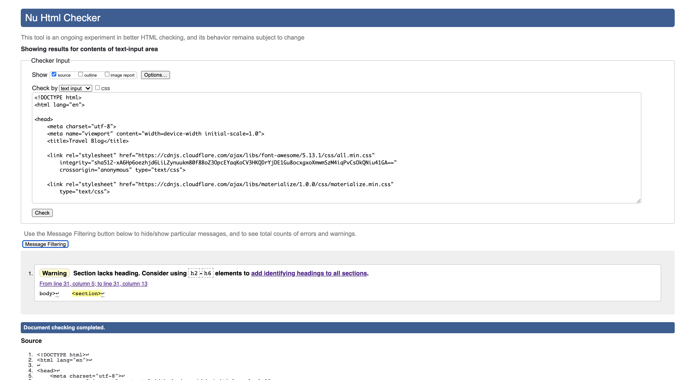
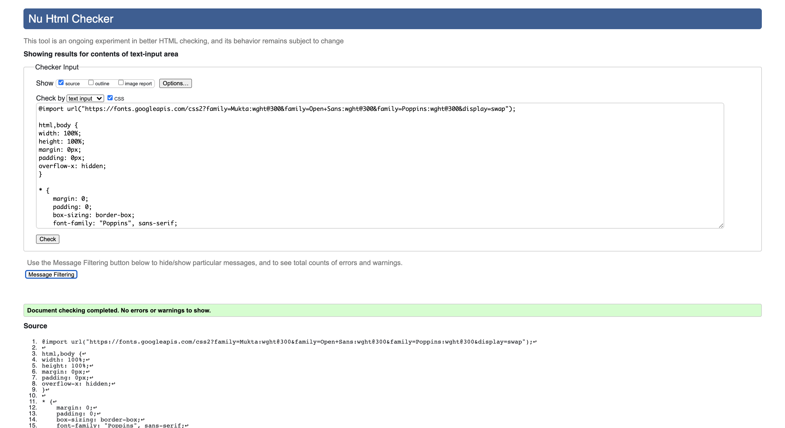

# Travel

This is my interactive Travel website. Utilizing [Google Maps API](https://developers.google.com/maps), [Rapid API](https://rapidapi.com/marketplace), JavaScript, Jquery. The website helps the user by giving reviews and expierences in diffrent countries.

## Project Goals
My aim for the project is to incorpirate various API"s so the user can access multiple information at once ranging from accomadation and maps. The main idead of the website is more so a blog of places ive been to in the past. Users can read information on each place see where it is located on the map, and they are able to view and book accomadation as well.

## External User Goals
* To find new holiday destinations, find accomadation and tourist destinations.

* Be able to plan ahead and plan travel routes.

* This website is my own personal blog of places I have travelled to. I wanted to to add destination for each place I thought were woth while seeing.

### Site owner's goal
To help usesrs choose their next holiday destination.

Make navigating through the website easy and understandable.

## UX
### Strategy
Display data from [Rapid-API](https://rapidapi.com/) displaying local hotels in the searched location.

### Scope
Within the scope of the project I have an interactive map that displays markers based on latitude and longitude data from the database.

I have also added an API for when a user searches a location in the world hotels in the surrounding area will show.

### Skeleton
#### Outside of scope:

- Authentication is not necessary as users can't contribute to the page or share information.

### Skeleton

# Wireframe Mockups
# Structure
- The website has multiple pages the user can navigate through.
- The home page consits of a video gallery users can scroll through.
- The travel page consits of a google maps API tha has markers displayed on the locations named from thr home page.
- The book page consits of a rapid API that displays a list of hotels when the user searches a location.
- The contact page just has a couple of input fields the user can add a message to send with their name, email ad phone.

# Skeleton
## Wireframe

## Home
 Gives a brief insite into each location. A short clip plays on loop in the background that will be related to each location.
 

 ## Destination Page
 When the user is in the home menu they will notice two arrows on the bottom right of the page. When they scroll throught the slides they will be met with a new destination, they will also notice a button at the end of the paragraph that is interactive that will bring them to a new page that will have a discription about the place and notable places that I feel are worth visiting.
  

## Travel
The user is met by a Google maps API. The map will have various pin points indicating each location on the map.

## Book
The booking page will have a search bar the user can click on and then they will have to type in a location they are wishing to travel to and they will be met by with a list of hotels and photos of those hotels.

## Contact
 On the contact page there user can contact me with any queries they are having they will be met by multipe input bars asking for their various details.

### Surface
- The home page consits of of videos that loop. The videos are visually appealing and draw the user in.
- The location pages are just plain white background with easy to read black text and visually appealing images.
- The travel page has a black background which makes the Google maps API stand out more and easier to navigate through.
- The booking page is a black background with white text which makes the photos and the name of the hotel stand out.
- The contact page is very visually appealing with the multiple colors and easy to navigate and read font.

## Features
### Existing Features

# Home Page
 * On the bottom left hand side of the web page there are some clickable icons that will bring the user to my Facebook, Instagram and my first Milestone project.
 * On the bottom right hand side of the bage there are two directional arrows each button will bring you to the next slide which will reveal a diffrent location, discription and a short video playing on loop.

 ## Nav-bar
 * The nav-bar has clickable link that will bring the user to a new page.
 * When hovering over a nav-bar link the background color changes to a solid white and the cursor changes to a pointer.
 
 ## Home page interactive buttons
 * On the bottom right hand of the screen there is a white bar going up the page. I have added my interactive social media links so when a user clicks on them it will bring them to my social media pages.
 * On the opposite side of the page there are two interactive arrow keys that allow the user scroll through the content.

 # Travel page
 When the user navigates through the nav-bar to the travel page they will be met by my [Google Maps API](https://developers.google.com/maps). There will be drop points placed on the map indicating where the countries listed on the home page are located. These are just some of the countries I have visited in the past. The map is interactive, the user can zoom in and out of the map and they can also choose to view it in map form terrain and satellite and this can be done on the top left corner of the page.

# Book 
When the user gets to this section they will be met by a search bar and when they search a location a list of hotels in that area will appear on screen.

# Contact 
This section is for users if they have any more questions they can leave their phone number and email and someone can get in contact with them regarding their question.

### Features left to implement

- I wanted to add labels to the markes on the google maps API.

- I was unsucessful at adding more information to my API such ass adding the cost of the hotel and displaying some data for when a user selects a hotel image.

# Testing errors
## Responsiveness
The website works as intended in Chrome, Mozilla and Microsoft Edge.

## User stories

As User 1 I am looking for a new travel destination and it was great to get some ideas and I was able to discover places I have never heared before.

As User 2 I will be looking for accomadation while I travel. It was great to be able to search a location and have a wide variety of hotels in the local area.

As User 3 I want to be abele to contact the site owner to be able to get some travel tips and here more about their expierences.

## Technologies Used

HTML 

CSS 

Bootstrap v 4.5.0 for advanced styling and positioning. This includes the grid structure and the navigation.

Javascript and Jquery for DOM manipulation.

LowDB to create local database.

Google Maps API

## Testing

### Testing in different browsers

The website works as intended in Chrome, Mozilla and Microsoft Edge, on mobile it works on ios for Apple. 

### Testing against the user stories

1.  User 1 can browse the entire map and check each information displayed when hovering over with the mouse  to see which one is of interest to them.

2.  User 2 the student can choose a preferred site type by using the radio buttons and following the link found in the info window appearing on mouse hover they can get to the site specific webpage of the UNESCO World Heritage Centre's website where they can get detailed information including history and significance.

 

3.  User 3 the person planning the short trip can focus the map on their own country and see what's nearby and what points of interests are also available in their area.

### Validation

HTML validation: https://validator.w3.org/  was used to validate the HTML code.

CSS validation: https://jigsaw.w3.org/css-validator/ was used to validate the CSS code.

JavaScript validation: https://jshint.com/ was used to check the JavaScript code.

## Problems encountered

1. Large number of data used from external source, which caused delays in loading the site. This was overcome by creating a local storage using LowDB.
2. Understanding and using the data structure was a challenge overall and proved to be the most time-consuming part of the process. For example figuring out how to access and use latitude and longitude information I needed for creating the markers.
2. Google maps infowindow's contents were not displaying the correct information. I used each location's id number as an identifier to access the required data string.

## Deployment

I started building the HTML of the website and did the styling using CSS on Repl.it then created the repository https://github.com/KittiKovacs/Milestone_2 on GitHub where I created the file structure and added the code created on the Repl.it platform.
I commited important development stages and any progress by using git commit and pushed them to the master branch.
As a next step I published the website on GitHub pages at https://kittikovacs.github.io/Milestone_2/ .
I split my JavaScript file into modules and stored them in a separate folder.
All commits after every important update has been added to my site on GitHub pages where my project is currently deployed.

## Content

UNESCO kindly gave their permission to use their XML data available on their website.

## Media

Image source: [Pexels](https://www.pexels.com/)

Fonts from [Google Fonts](https://fonts.google.com/)

Icons by [Icons8](https://icons8.com/)

Maps API by [Google Maps](https://cloud.google.com/maps-platform/)

Map styling from [Snazzymaps](https://snazzymaps.com/)

## Acknowledgements

Many thanks for the permission to UNESCO to use their name, logo and data.

My mentor Guido Cecilio Garcia Bernal had great suggestions and helped me manage the data and structure my code better.

Also a big thank you for the tutors at Code Institute especially Miklos and Johann.

# Technologies used
HTML

CSS

JavaScript and Jquery

[Google Maps API](https://developers.google.com/maps)

[Rapid API](https://rapidapi.com/marketplace)

[Font Awesome](https://fontawesome.com)

# Problems encounterd 
* I had difficulty displaying my google maps API at the beginning, I had to put all my JavaScript code on my travel.html for it to work correctly.
* My Rapid API's I found extremely difficult to work correctly. It will not load at the moment as I am getting '429' errors. I have attached a link to a [screenshot](milestone/assets/images/API(1).jpg) when I had it working correctly 

# Acknowledgements
* For my homepage I got the code from [Online Tutorials](https://www.youtube.com/watch?v=O2GOkNZ8sjw&t=682s).
* For my paragraph section on Ireland I got the quote from [Nomadic Matt](https://www.nomadicmatt.com/travel-guides/ireland/).
* For my paragraph section on Vancouver I got the quote from [Handle Luggage](https://handluggageonly.co.uk/2017/12/12/1-week-travel-plan-things-see-around-vancouver/).
* For my paragraph section on Amsterdam I got the quote from [a Blonnde Abroad](https://www.theblondeabroad.com/ultimate-amsterdam-travel-guide/).
* For my paragraph section on California I got the quote from [The Wandering Blonde](http://thewanderingblonde.com/category/north-america/united-states/california/).
* For my paragraph section on New York I got the quote from [a Blonnde Abroad](https://www.theblondeabroad.com/the-ultimate-guide-to-new-york-city-in-a-weekend/).